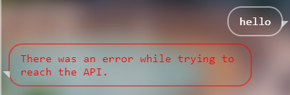
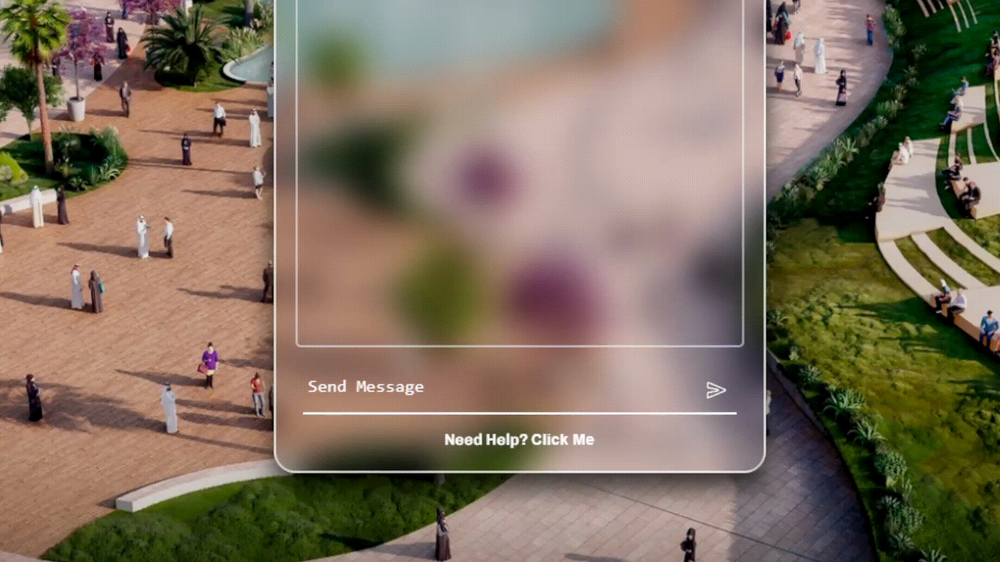
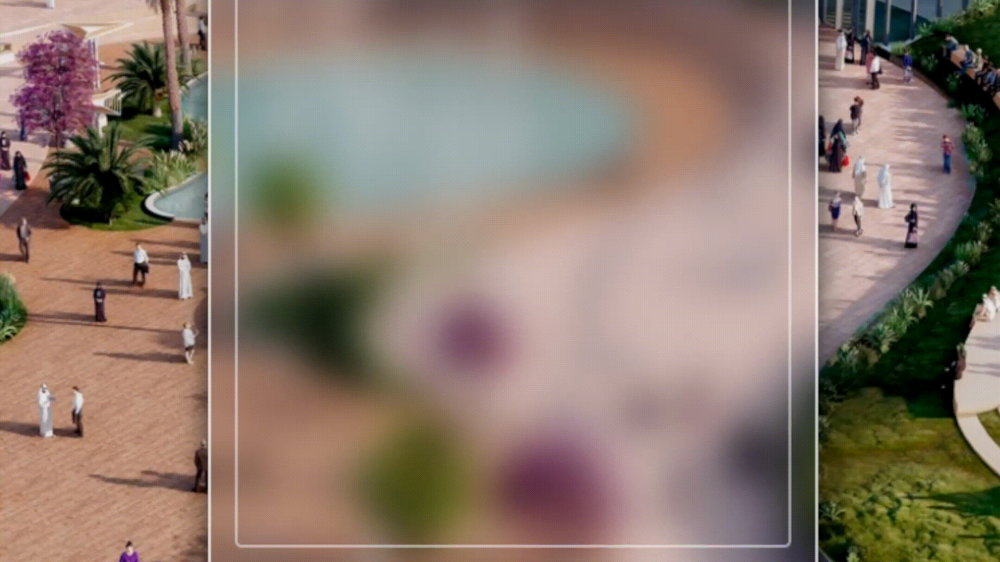

# Raj's Python Chatbot

This chatbot was made for my school's Techfest competition. 

It can answer questions about The Qatar Expo 2023.

The chatbot features a beautiful Glassmorphism GUI made with flask and HTML/CSS/JS.


## Installation

Use the package manager [pip](https://pip.pypa.io/en/stable/) to install the required packages.

```bash
pip install -r requirements.txt 
```

## Features

### Beautiful Glassmorphism UI

Homepage


Helppage


### Error Handling

API Error Message


### Animations

Message sent animation


Message bubble animation


Page load animation


